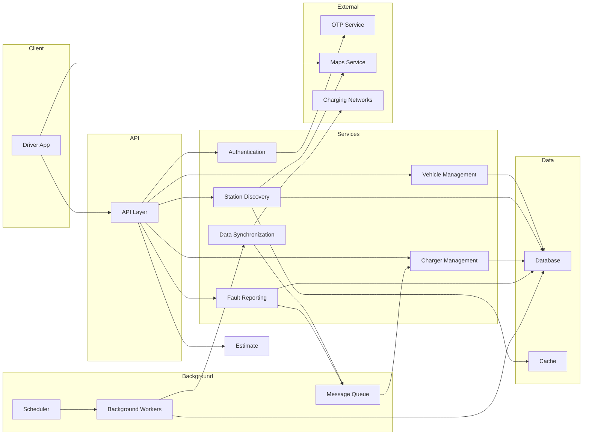
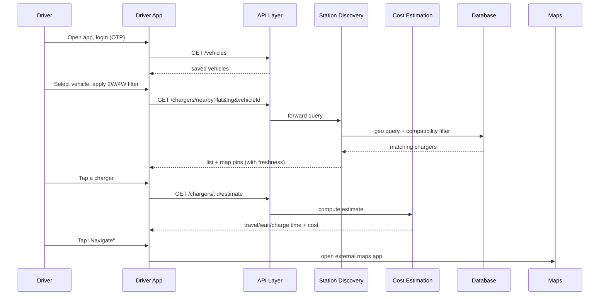
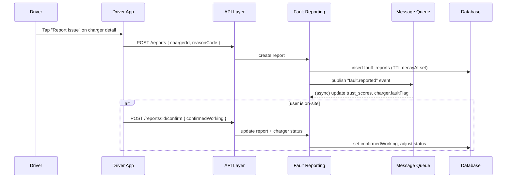
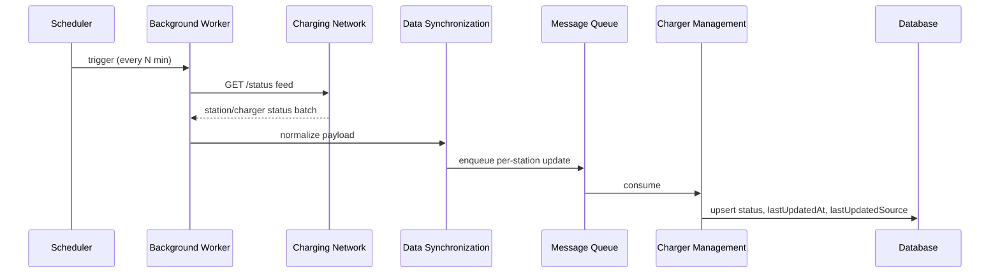
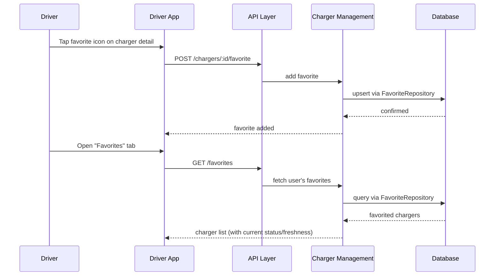

# ChargeFinder — Technical Design Document (TDD)

**Version:** 1.0
**Status:** Ready for Review
**Owner:** Ashish
**Related PRD:** 
[ChargeFinder_PRD_V2](./ChargeFinder_PRD_V2.md)
**DOC**: https://docs.google.com/document/d/1fVdLcuFMi2X1SHzRa_Z4A2ba-yWB0FKWc8RWbfKGwv4/edit?tab=t.0
---

## 1. Related Documents

| Document | Location | Notes |
|---|---|---|
| PRD | [ChargeFinder_PRD_V2](./ChargeFinder_PRD_V2.md) | Source of truth for scope, flows, must-haves |
| UX / Wireframes | [UX](https://claude.ai/public/artifacts/feb2801e-977c-44d6-a330-7261a3a80467)  | To be linked once available |

**Assumptions carried from PRD:** 
- single launch city, 3–5 pilot CPOs, 10–20 stations at launch,
- 8-week MVP delivery window (per PRD §19). 
- This TDD scopes infrastructure and design decisions to that scale, with scale-out notes in §7.
---

## 2. Overview

ChargeFinder MVP consists of three client-facing surfaces and one internal surface, backed by a shared platform:

1. **Driver PWA** — vehicle setup, map discovery, charger detail, fault reporting.
2. **Operator Portal (web)** — CPO-facing dashboard for manual data/status updates (PRD §13, Mode 1).
3. **Public/Partner API** — for Mode 2 CPOs with their own backend (API sync).
4. **Admin/Internal tools** — manual backfill of static data, pilot monitoring.

**Design goals for the TDD:**
- Optimize for correctness of "is this charger real, compatible, and working right now" over feature breadth.
- Keep operator data ingestion decoupled from driver-facing reads (PRD principle: "keep operator workflows separate from driver workflows").
- Make live-status staleness a first-class, visible property of the data model, not an afterthought.

---

## 3. Architecture

### 3.1 High-level component diagram
Diagram Link: https://excalidraw.com/#json=DfsnApDfm5xjrclSXBMvu,jFgP3kpil6_ZUP4-gpTKhA



### 3.2 Component responsibilities

- **Authentication** — Phone OTP issuance/verification, session token issuance and refresh.
- **Vehicle Management** — CRUD for "My Vehicles," vehicle-type → connector/compatibility mapping (PRD §6).
- **Station Discovery** — geospatial nearby-charger queries, 2W/4W filter, compatibility filter, cached read-optimized responses.
- **Charger Management** — source of truth for static + dynamic charger data; owns the freshness label logic.
- **Fault Reporting** — accepts timestamped reports, triggers "confirm if you're there" flow, feeds trust/confidence scoring.
- **Cost Estimation** — rule-based calculator (travel time, wait time, charging duration, cost) per PRD §9.
- **Data Synchronization** — backs API-sync CPOs: pulls or receives pushes from operator backends, normalizes into Chargefinder's schema.
- **Scheduler + Background Workers** — scheduled jobs: freshness decay, fault-report decay, CPO sync polling cadence.
- **Message Queue** — decouples data-synchronization writes from the read path so a slow or failing CPO feed can't block charger reads.

### 3.3 Why this shape

- **Service-per-responsibility**, not a single monolith, but grouped into a small enough number of deployable units to keep the 8-week MVP timeline realistic — fewer moving parts than full microservices, with clean seams for splitting later.
- **Scheduled sync over always-on push**: freshness and CPO sync run on a scheduler rather than a persistent push connection. This fits MVP scale (10–20 stations, a handful of operators) well — a periodic cadence is simple to operate and debug, and avoids maintaining persistent client/server connections for a dataset this small. Flagged in §7 as the first thing to revisit at scale.
- **Document-oriented database**: fits the mixed static/dynamic shape of a "charger" record (nested connectors, pricing rules, live status, fault history) better than normalizing across relational tables, and supports geospatial queries for "nearby chargers" directly.

---

## 4. Tech Stack / Dependencies

### 4.1 Frontend (Driver App)

| Concern | Choice | Notes |
|---|---|---|
| Framework | Next.js | React Server Components (RSC) for SEO-relevant pages |
| Language | TypeScript | Type safety across app and API layer |
| Styling | Tailwind CSS | |
| Design system | shadcn/ui | |
| Data fetching/caching | TanStack Query | Request de-duplication, caching, background refetch |
| State management | React Context | No external state library at MVP scope |
| Maps | Google Maps JS library | |
| Live data | Long polling | Chosen over WebSockets/SSE for MVP simplicity |
| App type | PWA | Installable, offline shell |
| Error handling | Error boundaries per section | Isolates a broken section instead of crashing the whole page |
| Business logic | API hooks | Business logic lives in hooks, not components |
| Static analysis | ESLint + SonarQube | |
| Unit testing | React Testing Library | |
| Observability | Sentry | Logging, error tracing, Web Vitals performance monitoring, user telemetry |
| Product analytics | Microsoft Clarity + Google Analytics 4 | Session replay + behavioral analytics |

### 4.2 Backend

| Concern | Choice | Notes |
|---|---|---|
| Runtime/framework | Node.js + Express | |
| Compute | EC2 (Auto Scaling Group, multiple instances) | See §3.1 |
| Database access | Repository classes (e.g. `UserRepository.findById(id)`) | Convention: suffix `Repository`, see §3.3, §5.2 |
| Database | MongoDB Atlas (managed) | `2dsphere` geo index; per-collection TTL for stale fault reports |
| Cache | Redis (ElastiCache) | Nearby-search response cache, session/rate-limit store |
| Background/scheduled work | Lambda (concurrent invocations) + Scheduler | CPO data sync — see §3.2 |
| Queue | SQS | Decouples sync/report writes from the read path |
| API layer | API Gateway | Routing + rate limiting |
| Auth | Custom OTP service + JWT | SMS via a provider (e.g., MSG91/Twilio — confirm with vendor eval) |
| Maps | Google Maps Platform | Directions, geocoding |
| Infra as code | Terraform | Repeatable EC2/Lambda/Mongo Atlas provisioning |

### 4.3 CI/CD

| App | Pipeline | Target |
|---|---|---|
| Next.js app (Driver App) | Vercel or Render.com | Managed build/deploy, preview environments per PR |
| Express backend | GitHub Actions (`deploy.yml`) | Deploys to EC2 |

### 4.4 Observability & Analytics

| Concern | Tool | Notes |
|---|---|---|
| Logging, tracing, performance, error tracking, user telemetry | Sentry | Single tool covering frontend + backend |
| Product/behavioral analytics | Microsoft Clarity, Google Analytics 4 | Session replay, funnel/behavior analysis |

---

## 5. Low-Level Design (LLD)

### 5.1 Core data model (MongoDB)

```javascript
// vehicles
{
  _id, userId, type: "2W_SCOOTER" | "2W_MOTORCYCLE" | "3W" | "4W",
  connectorTypes: ["Type2", "CCS2", "GB/T"],
  chargingSpeedClass: "SLOW" | "FAST" | "RAPID",
  registrationNumber, createdAt
}

// stations
{
  _id, name, address, location: { type: "Point", coordinates: [lng, lat] },
  amenities: [String],
  operatorId, integrationMode: "PORTAL" | "API_SYNC",
  chargers: [
    {
      chargerId, connectorType, maxPowerKw,
      status: "AVAILABLE" | "IN_USE" | "UNAVAILABLE" | "MAINTENANCE",
      pricePerKwh, lastUpdatedAt, lastUpdatedSource: "OPERATOR" | "CPO_API" | "COMMUNITY",
      faultFlag: Boolean, faultReportedAt
    }
  ]
}
// index: { location: "2dsphere" }

// fault_reports
{
  _id, chargerId, stationId, userId, reasonCode, note,
  reportedAt, confirmedOnSiteAt, confirmedWorking: Boolean|null,
  decayAt  // TTL-managed field
}

// trust_scores (Should-have)
{
  _id, chargerId, confirmationCount7d, faultCount7d, score
}
```

### 5.2 Key API contracts (representative, not exhaustive)

```
POST /auth/otp/request        { phone }
POST /auth/otp/verify         { phone, otp } -> { accessToken, refreshToken }

POST /vehicles                { type, connectorTypes, registrationNumber? }
GET  /vehicles                -> [Vehicle]

GET  /chargers/nearby?lat&lng&radiusKm&vehicleId&type=2W|4W
     -> [{ stationId, chargerId, distance, status, price, powerKw, freshness }]

GET  /chargers/:chargerId     -> full detail + estimate block
POST /chargers/:chargerId/estimate  { vehicleId } -> { travelTimeMin, waitTimeMin, chargeTimeMin, costEstimate }

POST /reports                 { chargerId, reasonCode, note }
POST /reports/:id/confirm     { confirmedWorking: boolean }   // on-site confirmation

# Operator Portal
POST /operator/stations
PATCH /operator/chargers/:id/status
PATCH /operator/chargers/:id/pricing
PATCH /operator/chargers/:id/maintenance-mode

# CPO API sync (Mode 2, inbound from CPO or polled by IngestSvc)
POST /partner/v1/stations/:externalId/status   { status, price, lastUpdatedAt }
```
### 5.3 UI component structure (Driver PWA)

```
App
 ├─ AuthFlow (OtpRequest, OtpVerify)
 ├─ VehicleSetup (VehicleTypePicker, VehicleList)
 ├─ MapView
 │   ├─ FilterBar (2W/4W toggle, connector filter)
 │   ├─ ChargerMarkerLayer
 │   └─ NearbyListSheet
 ├─ ChargerDetail
 │   ├─ StatusBadge (with freshness label)
 │   ├─ EstimateBlock
 │   ├─ ReportIssueModal
 │   └─ OnSiteConfirmPrompt
 └─ Favorites (Should-have)
```

### 5.4 Freshness & fault-decay logic (LLD detail)

- Every write to `chargers.$.status` sets `lastUpdatedAt` and `lastUpdatedSource`.
- A scheduled Lambda (EventBridge cron, every 5 min) computes a `freshnessLabel` bucket (`"just now"`, `"Xm ago"`, `"stale — Xd ago"`) — computed at read time in the API is actually preferred over precomputing, to avoid clock-drift bugs; the Lambda's job is instead to **flag** chargers whose `lastUpdatedAt` exceeds a threshold (e.g., 24h) so they can be deprioritized in `/chargers/nearby` ranking.
- Fault reports decay via MongoDB TTL index on `decayAt` (set to `reportedAt + 72h` unless reconfirmed), matching PRD §10's "decay old fault reports unless confirmed again."

---

## 6. Flow / Sequence Diagrams

### 6.1 Flow 1 — Find a charger



### 6.2 Flow 2 — Report a problem



### 6.3 CPO data sync (Mode 2 — API sync)



### 6.4 Flow 3 — Save a favorite


---

## 7. Scalability

**MVP scale reality (per PRD):** 1 city, 10–20 stations, 3–5 CPOs, an unspecified but presumably modest driver user base. The design below is intentionally right-sized for that, with explicit notes on what breaks first and how to evolve.

| Concern | MVP approach | First scale trigger | Evolution path |
|---|---|---|---|
| Live status delivery | EventBridge cron polling (Mode 2) + direct writes (Mode 1 portal) | Multi-city rollout, or CPOs wanting sub-30s status latency | Move to WebSocket/SSE push for driver clients; event-driven ingestion (webhooks from CPO instead of polling) |
| Geo queries | Single Mongo Atlas cluster, `2dsphere` index | Query latency degrades as station count and concurrent nearby-search load grow | Read replicas; Redis-cached hot-tile results by geohash bucket |
| Nearby-search caching | Redis cache keyed by geohash + filters, short TTL (30–60s) | Cache miss rate rising with more cities | Precompute per-city hot zones; edge caching at CloudFront for anonymous browse |
| Backend services | ECS Fargate, small fixed task count | Sustained CPU/mem pressure or multi-city launch | Auto-scaling policies per service; split Discovery Service out first (highest read QPS) |
| CPO ingest | Single Ingest Service, sequential polling loop | More than ~10-15 Mode-2 CPOs | Parallelize polling via SQS fan-out per CPO; per-CPO rate limiting |
| Multi-city | Not designed for yet — single-region assumption in queries/config | Explicit multi-city launch decision (PRD open question) | City as a first-class dimension in routing/config, not just a data filter |

---

## 8. Security

- **Auth:** OTP-based driver auth (rate-limited per phone number, exponential backoff on retries); short-lived JWT access tokens + refresh token rotation. Operator Portal uses separate credentials (recommend email/password + optional MFA, since CPOs are business accounts with write access to pricing/status).
- **Authorization:** Role-based — `driver`, `operator`, `admin`. Operator Portal API scopes every write to the operator's own `stationId`s only (enforced server-side, not just UI-hidden).
- **Data in transit:** TLS everywhere (CloudFront, API Gateway, service-to-service).
- **Data at rest:** Mongo Atlas encryption at rest; S3 default encryption.
- **PII handling:** Phone numbers are the main PII; store hashed/last-4 where full number isn't needed for display; minimize logging of raw phone numbers (mask in logs).
- **CPO API sync security:** API keys or mutual-auth per CPO for Mode 2; signed payloads if the CPO's system supports it; ingest service validates payload schema before writing (prevents a bad CPO feed from corrupting shared charger data).
- **Abuse prevention:** Rate limits on fault-report submission per user/device to prevent report spam from gaming trust scores; CAPTCHA or device-attestation fallback if abuse observed in pilot.
- **Secrets management:** AWS Secrets Manager for DB creds, SMS provider keys, Maps API key (with domain/referrer + quota restrictions on the Maps key specifically, since it's client-exposed).

---

## 9. Observability

- **Logging:** Structured JSON logs per service, correlation ID propagated from API Gateway through to async Lambda/SQS consumers, so a single fault report or sync event can be traced end-to-end. Centralized in CloudWatch Logs.
- **Metrics (CloudWatch + Grafana dashboards):**
  - Business: activation rate, nearby-search volume, report rate, freshness % within threshold (these map directly to PRD §17 success metrics — worth wiring dashboards to the same definitions PRD uses).
  - System: p50/p95 latency per endpoint, error rate, EventBridge job success/failure, SQS queue depth and age-of-oldest-message (a growing ingest lag is the first sign the polling cadence is too slow).
- **Tracing:** AWS X-Ray across API Gateway → ECS services → Mongo/SQS calls.
- **Error tracking:** Sentry for PWA and backend exceptions, with release tagging per deploy.
- **Alerting:** PagerDuty/CloudWatch Alarms on — ingest job failures, freshness % dropping below threshold, OTP delivery failure rate, elevated 5xx rate.

---

## 10. Testing

| Layer | Approach |
|---|---|
| Unit | Jest across NestJS services (business logic: compatibility matching, estimate calculator, freshness bucketing) and React components (driver PWA, operator portal) |
| Integration | Supertest against each service with a test Mongo instance (mongodb-memory-server or dockerized Atlas local); verify API contracts in §5.2 |
| Contract testing | For CPO API sync (Mode 2) — schema validation tests against sample CPO payloads, since this is the highest-risk integration point per PRD risks (§18: "stale or inaccurate live data") |
| E2E | Playwright covering PRD's three core flows (§8): find-a-charger, report-a-problem, booking-supported charger, run against a staging environment with seeded pilot-city data |
| Load/perf | k6 or Artillery against `/chargers/nearby` — this is the highest-traffic, latency-sensitive endpoint; validate against expected pilot concurrency before go-live |
| Manual/UAT | Pilot-city test pass with real vehicles at real pilot stations before public MVP launch (PRD §19, Week 6-7) |

---

## 11. Deployment (Rollout)

- **Environments:** dev → staging → production, each with its own Mongo Atlas project/cluster tier and isolated AWS account or VPC.
- **CI/CD:** GitHub Actions — lint/test/build on PR, deploy to staging on merge to `main`, manual promotion gate to production.
- **Rollout sequencing (maps to PRD §19 delivery plan):**
  1. Weeks 1–2: infra scaffolding (Terraform base, ECS cluster, Mongo Atlas project, CI pipelines) alongside product's operator/city groundwork.
  2. Weeks 3–5: deploy core services to staging incrementally as built (Auth → Vehicle → Discovery → Charger/Report → Estimate → Operator Portal API).
  3. Weeks 6–7: staging pilot with real CPOs and limited users; feature-flag any Should-have items (favorites, booking, trust badge) so they can ship dark and be toggled independently of the MVP go-live.
  4. Week 8: production go-live, single city.
- **Progressive exposure:** Feature flags (e.g., LaunchDarkly or a lightweight in-house flag service) for booking and community trust badge, so they can roll out to a subset of pilot users first.
- **Blue/green or rolling deploys** on ECS Fargate for zero-downtime backend releases; CloudFront/S3 atomic swap for PWA static asset releases.

---

## 12. Rollback

- **Backend services (ECS):** rolling deploy with automatic rollback on failed health checks; previous task definition kept as immediate rollback target (single command/one-click revert).
- **Database:** MongoDB Atlas continuous backups with point-in-time restore; schema changes designed additive-first (new optional fields, no destructive migrations) during MVP so a code rollback doesn't require a matching DB rollback.
- **PWA/static assets:** CloudFront + S3 versioned deploys — rollback is a pointer swap to the previous build, not a rebuild.
- **CPO ingest:** if a bad feed from a Mode-2 CPO corrupts live status data, Ingest Service writes are versioned per-station so the last-known-good state can be restored without affecting other stations; a circuit breaker pauses ingestion from a specific CPO if its payloads start failing schema validation repeatedly.
- **Feature-flagged rollout:** Should-have features can be killed instantly via flag flip without a full deploy/rollback cycle.
- **Rollback trigger criteria:** define these explicitly before go-live — e.g., error rate > X%, freshness % dropping below threshold, OTP failure spike — so rollback decisions aren't made ad hoc during the pilot.

---

## Open items requiring your decision

1. SMS/OTP vendor selection.
2. Don't know about much rollback strategy?
3. Some issues with AWS too.
4. Operator Portal auth model (recommend separate from driver OTP — confirm).
5. Multi-city readiness — confirmed out of scope for MVP per PRD, but worth flagging where in this architecture that assumption is baked in (§7) so it's a conscious debt, not a surprise later.
6. UX/wireframes not yet available — once provided, §5.3 (component structure) and §6 (flows) should be revisited against actual screens.
