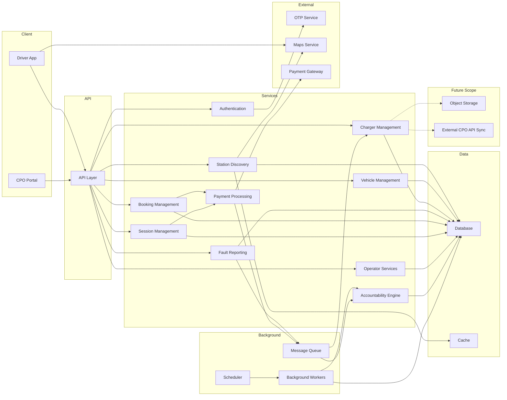
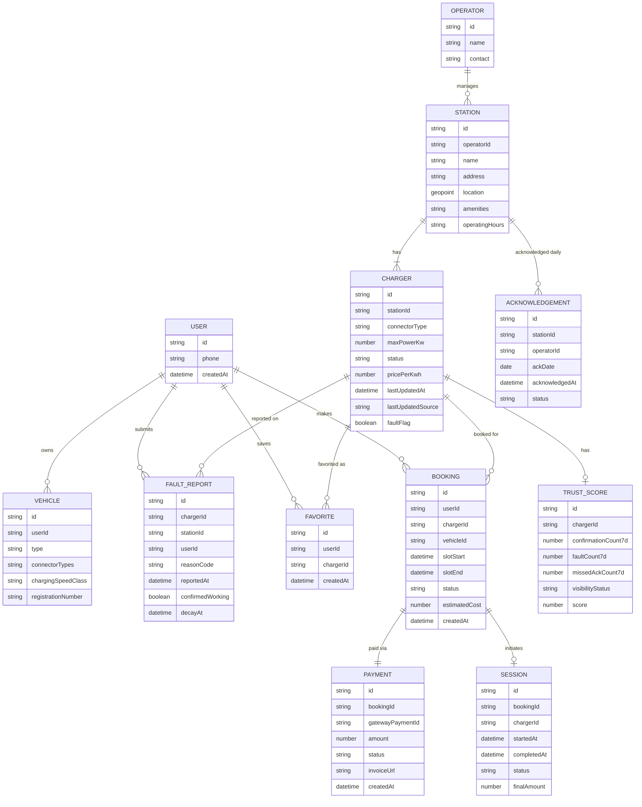
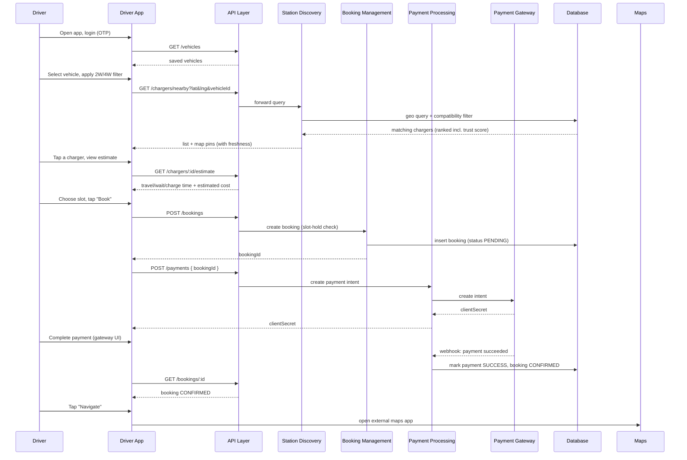
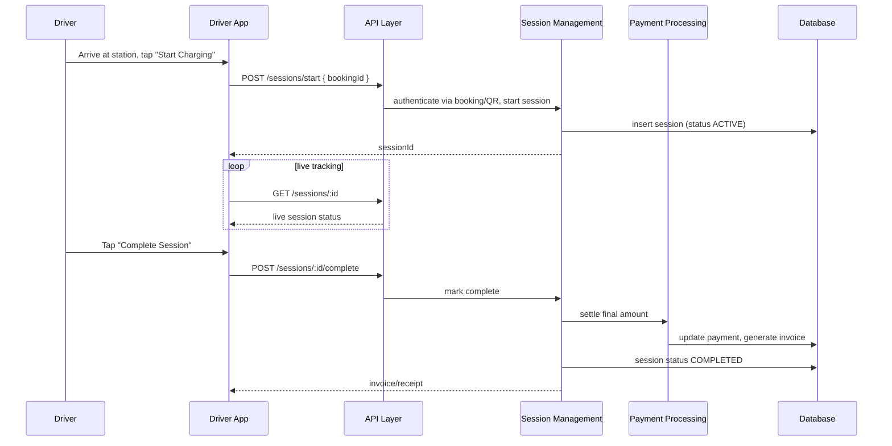
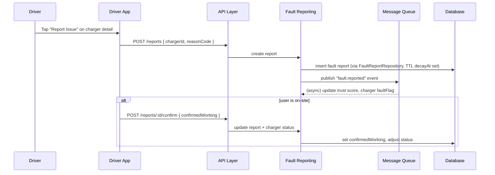
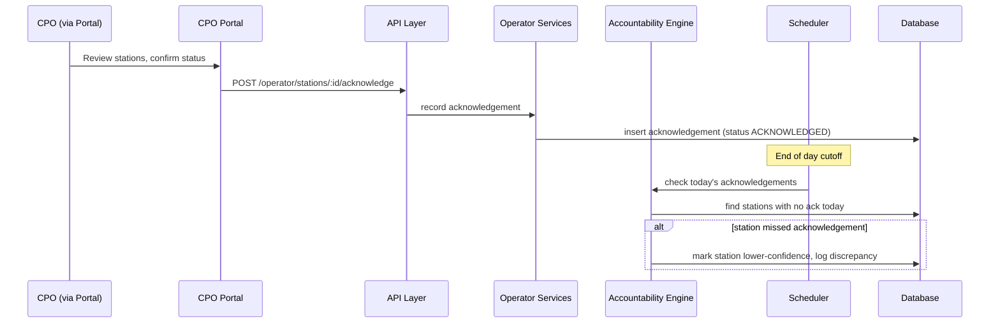
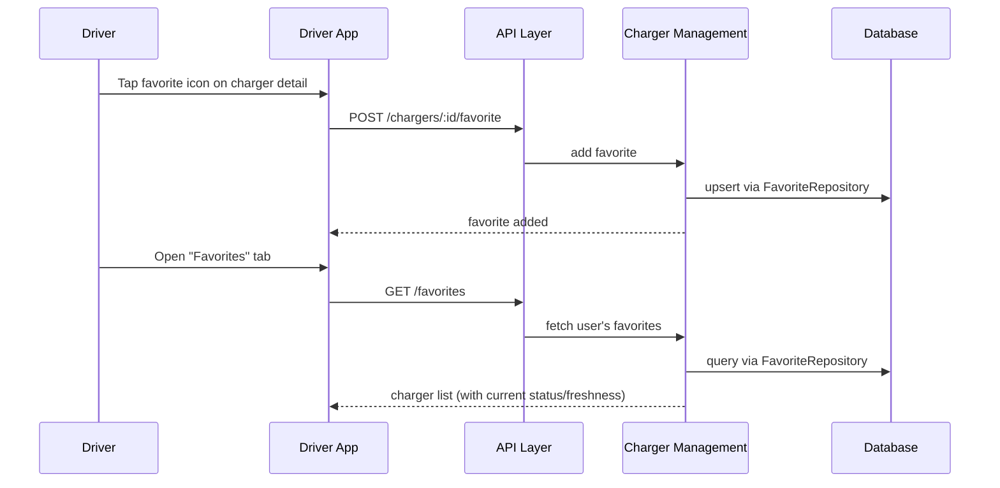

# ChargeHub — Technical Design Document (TDD)

**Version:** 3.0
**Status:** Draft — V3 (Booking + Payment + CPO Portal core)
**Owner:** Ashish, Ashwini, Ratanadeep
**Related PRD:**
---

## 1. Related Documents

| Document | Location | Notes |
|---|---|---|
| PRD (current) | [ChargeFinder_PRD_V3](./ChargeFinder_PRD_V3.md) | Source of truth for scope, flows, must-haves — booking + payment + CPO accountability model |
| TDD review | [HackMD review](https://hackmd.io/LxiVoKqCRk-dvTFdZF0RoQ?both) | Review link for TDD feedback |
| PRD review | [Google Doc review](https://docs.google.com/document/d/1i-_Djyi36fmY40HSNdqFwWQnaZwMOZzLs-nzqPEbxbQ/edit?tab=t.0) | Review link for PRD feedback |
| UX / Wireframes | [UX](https://claude.ai/public/artifacts/feb2801e-977c-44d6-a330-7261a3a80467) | Reflects an earlier (discovery-only) flow — needs a pass for booking/payment/session screens |

**Assumptions carried from PRD V3:**
- single launch city, 3–5 pilot CPOs, 10–20 stations at launch,
- 8-week MVP delivery window (per PRD §21),
- CPO Portal is the **only** operator management model in MVP — no external CPO backend integration,
- booking and in-app payment (via gateway) are core, not optional.

---

## 2. Overview

ChargeHub MVP is now a **booking app**, not a discovery app, with two client-facing surfaces and one internal surface:

1. **Driver App** — vehicle setup, map discovery, charger detail, booking, payment, session tracking, favoriting, fault reporting.
2. **CPO Portal (web)** — the *only* operator management surface: station/connector setup, pricing, maintenance mode, booking calendar, daily status acknowledgement, settlement summary (PRD §11, §15).
3. **Admin/Internal tools** — pilot monitoring, discrepancy/accountability oversight.

**Design goals for this revision:**
- Booking-first: the charger detail page must answer "can I book this, right now, for what it'll cost" before the driver commits (PRD §5, §9).
- Make CPO accountability a first-class, visible system property — daily acknowledgement, discrepancy history, and ranking impact are data, not just policy (PRD §12).
- Keep payment handling thin: ChargeHub orchestrates bookings/sessions and calls out to a payment gateway; it does not hold funds or build a ledger.

**Scope notes (major changes from the prior TDD revision):**
- **CPO Portal is back as core MVP**, not Future Scope — PRD V3 makes it the sole operator model.
- **External CPO API sync is now explicitly out of MVP** (PRD §15: "No external CPO system integration is required in MVP") — moved to Future Scope.
- **Booking, Payment, and Session** are new core components.
- **Cost/time estimation** (PRD §9) is folded into Booking Management rather than kept as a separate service, since in V3 it exists specifically to support the booking decision, not as a standalone lookup.
- **Object Storage** remains deferred — see §13.

---

## 3. Architecture

### 3.1 High-level component diagram

*Note: this supersedes the previously linked Excalidraw diagram, which reflects the pre-V3 (discovery-only) architecture. Flag if you'd like a refreshed Excalidraw export of the diagram below.*



### 3.2 Component responsibilities

- **Authentication** — Phone OTP issuance/verification, session token issuance and refresh (drivers); separate credential flow for CPO Portal (see §8).
- **Vehicle Management** — CRUD for "My Vehicles," vehicle-type → connector/compatibility mapping (PRD §6).
- **Station Discovery** — geospatial nearby-charger queries, 2W/4W filter, compatibility filter, cached read-optimized responses; ranking factors in the Accountability Engine's trust score.
- **Charger Management** — source of truth for static + dynamic charger data; owns the freshness label logic and the driver's favorited-chargers list.
- **Booking Management** — slot availability, booking creation/confirmation, booking calendar; computes the pre-booking estimate (travel time, wait time, charging duration, approximate cost per PRD §9) as part of the booking-detail response.
- **Session Management** — session lifecycle: authenticate at station (via booking reference or QR), start session, track live status, mark complete; hands off to Payment Processing on completion.
- **Payment Processing** — thin orchestration over the external Payment Gateway: creates a payment intent for a booking/session, confirms payment, generates invoice/receipt; does not hold funds. Webhook events from the gateway are processed asynchronously via the Message Queue, not synchronously in the request path.
- **Fault Reporting** — accepts timestamped reports, triggers "confirm if you're there" flow, feeds the Accountability Engine.
- **Operator Services** — CPO Portal backend: station/connector CRUD, pricing, maintenance mode, out-of-service reason, booking calendar (operator side), settlement summary.
- **Accountability Engine** — implements PRD §12: tracks daily acknowledgement per station, maintains discrepancy history, computes/updates trust score, and triggers reduced visibility, ranking penalties, or delisting when thresholds are crossed.
- **Scheduler + Background Workers** — scheduled jobs: freshness decay, fault-report decay, and the **daily acknowledgement check** — if a station hasn't acknowledged by its cutoff, the Accountability Engine is invoked to mark it lower-confidence/stale.
- **Message Queue** — decouples fault-report and payment-webhook processing from the request path, so a slow downstream update can't block a driver-facing read or a payment confirmation.

All services that talk to the database do so exclusively through a **Repository** layer (see §5.2).

### 3.3 Why this shape

- **CPO Portal restored as the only operator surface**: removing the external-API-sync path (per PRD §15) simplifies the system materially — no ingest/normalization pipeline, no per-CPO schema validation, no polling cadence to tune. The trade is that ChargeHub now owns 100% of data-freshness accountability, which is why the Accountability Engine is a first-class component rather than a background job bolted onto Charger Management.
- **Payment kept thin on purpose**: using a gateway (Razorpay/Stripe-style, per your call) means Payment Processing never touches card data or holds a balance — it creates intents, confirms them, and reacts to webhooks. This keeps PCI scope minimal and defers "do we need our own ledger" as a real Future Scope question rather than something solved ad hoc now.
- **Booking and Session are separate services** even though they're sequential in the user's mind (book → arrive → charge) because they have different consistency needs: Booking needs to prevent double-booking a slot (needs a strong consistency check at write time); Session is more of an event/state-tracking log once the slot is already committed.
- **Estimate folded into Booking, not standalone**: PRD V3 only surfaces the estimate as a pre-booking decision aid (§9), so giving it its own service would just add a network hop for no independent value at this scale.
- **Repository naming convention, EC2 compute, rate limiting at the gateway**: unchanged from the prior revision — see §4 for the concrete stack.

---

## 4. Tech Stack / Dependencies

### 4.1 Frontend (Driver App + CPO Portal)

| Concern | Choice | Notes |
|---|---|---|
| Framework | Next.js | React Server Components (RSC) for SEO-relevant pages (Driver App); CPO Portal can be a standard Next.js app without the SEO requirement |
| Language | TypeScript | Type safety across app and API layer |
| Styling | Tailwind CSS | |
| Design system | shadcn/ui | |
| Data fetching/caching | TanStack Query | Request de-duplication, caching, background refetch |
| State management | React Context | No external state library at MVP scope |
| Maps | Google Maps JS library | |
| Live data | Long polling | Booking status, session status, charger status |
| App type | PWA (Driver App) | Installable, offline shell |
| Error handling | Error boundaries per section | Isolates a broken section instead of crashing the whole page |
| Business logic | API hooks | Business logic lives in hooks, not components |
| Static analysis | ESLint + SonarQube | |
| Unit testing | React Testing Library | |
| Observability | Sentry | Logging, error tracing, Web Vitals performance monitoring, user telemetry |
| Product analytics | Microsoft Clarity + Google Analytics 4 | Session replay + behavioral analytics |

### 4.2 Backend

| Concern | Choice | Notes |
|---|---|---|
| Runtime/framework | Node.js + Express | |
| Compute | EC2 (Auto Scaling Group, multiple instances) | See §3.1 |
| Database access | Repository classes (e.g. `BookingRepository.findById(id)`) | Convention: suffix `Repository`, see §3.3, §5.2 |
| Database | MongoDB Atlas (managed) | `2dsphere` geo index; per-collection TTL for stale fault reports |
| Cache | Redis (ElastiCache) | Nearby-search response cache, session/rate-limit store, slot-hold locks for booking |
| Background/scheduled work | Scheduler + Background Workers | Freshness decay, fault decay, daily acknowledgement check, payment webhook processing |
| Queue | SQS | Decouples fault-report and payment-webhook processing from the request path |
| API layer | API Gateway | Routing + rate limiting |
| Auth | Custom OTP service + JWT (driver); separate credentials for CPO Portal | SMS via a provider (e.g., MSG91/Twilio — confirm with vendor eval) |
| Maps | Google Maps Platform | Directions, geocoding |
| Payments | External payment gateway (Razorpay/Stripe-style) | ChargeHub does not touch funds directly — vendor selection is an open item, see §14 |
| Infra as code | Terraform | Repeatable EC2/Mongo Atlas provisioning |

### 4.3 CI/CD

| App | Pipeline | Target |
|---|---|---|
| Next.js apps (Driver App, CPO Portal) | Vercel or Render.com | Managed build/deploy, preview environments per PR |
| Express backend | GitHub Actions (`deploy.yml`) | Deploys to EC2 |

### 4.4 Observability & Analytics

| Concern | Tool | Notes |
|---|---|---|
| Logging, tracing, performance, error tracking, user telemetry | Sentry | Single tool covering both frontends + backend |
| Product/behavioral analytics | Microsoft Clarity, Google Analytics 4 | Session replay, funnel/behavior analysis |

---

## 5. Low-Level Design (LLD)

### 5.1 Entity Relationship Diagram



### 5.2 Repository layer

```javascript
const vehicle = await VehicleRepository.findById(vehicleId);
const nearby = await ChargerRepository.findNearby({ lat, lng, radiusKm, vehicleType });
const booking = await BookingRepository.create({ userId, chargerId, vehicleId, slotStart, slotEnd });
const payment = await PaymentRepository.create({ bookingId, amount, gatewayPaymentId });
await SessionRepository.markCompleted(sessionId, { finalAmount });
await AcknowledgementRepository.record(stationId, operatorId, ackDate);
await FavoriteRepository.add(userId, chargerId);
```

Repositories to define at minimum: `UserRepository`, `VehicleRepository`, `StationRepository`, `ChargerRepository`, `FaultReportRepository`, `FavoriteRepository`, `BookingRepository`, `PaymentRepository`, `SessionRepository`, `AcknowledgementRepository`, `TrustScoreRepository`.

### 5.3 Core data model (MongoDB, shape reference)

```javascript
// bookings
{
  _id, userId, chargerId, vehicleId,
  slotStart, slotEnd,
  status: "PENDING" | "CONFIRMED" | "CANCELLED" | "COMPLETED",
  estimatedCost, createdAt
}

// payments
{
  _id, bookingId, gatewayPaymentId,
  amount, status: "INITIATED" | "SUCCESS" | "FAILED" | "REFUNDED",
  invoiceUrl, createdAt
}

// sessions
{
  _id, bookingId, chargerId,
  startedAt, completedAt,
  status: "ACTIVE" | "COMPLETED" | "ABORTED",
  finalAmount
}

// acknowledgements
{
  _id, stationId, operatorId, ackDate,
  acknowledgedAt, status: "ACKNOWLEDGED" | "MISSED"
}

// trust_scores (extended for accountability)
{
  _id, chargerId,
  confirmationCount7d, faultCount7d, missedAckCount7d,
  visibilityStatus: "NORMAL" | "REDUCED" | "DELISTED",
  score
}
```

### 5.4 Key API contracts (representative, not exhaustive)

```
POST /auth/otp/request        { phone }
POST /auth/otp/verify         { phone, otp } -> { accessToken, refreshToken }

POST /vehicles                { type, connectorTypes, registrationNumber? }
GET  /vehicles                -> [Vehicle]

GET  /chargers/nearby?lat&lng&radiusKm&vehicleId&type=2W|4W
     -> [{ stationId, chargerId, distance, status, price, powerKw, freshness }]

GET  /chargers/:chargerId     -> full detail (status, price, power, ETA)
GET  /chargers/:chargerId/estimate?vehicleId  -> { travelTimeMin, waitTimeMin, chargeTimeMin, estimatedCost }

POST /bookings                { chargerId, vehicleId, slotStart, slotEnd } -> { bookingId, status, estimatedCost }
GET  /bookings/:id            -> booking detail
POST /bookings/:id/cancel

POST /payments                { bookingId } -> { paymentIntentId, gatewayClientSecret }
POST /payments/:id/confirm    -> { status }
POST /payments/webhook        (gateway -> ChargeHub, signature-verified)

POST /sessions/start          { bookingId } -> { sessionId }
GET  /sessions/:id            -> live session status
POST /sessions/:id/complete   -> triggers final payment settlement + invoice

POST   /chargers/:chargerId/favorite
DELETE /chargers/:chargerId/favorite
GET    /favorites              -> [Charger]

POST /reports                 { chargerId, reasonCode, note }
POST /reports/:id/confirm     { confirmedWorking: boolean }

# CPO Portal
POST  /operator/stations
PATCH /operator/chargers/:id/status
PATCH /operator/chargers/:id/pricing
PATCH /operator/chargers/:id/maintenance-mode
POST  /operator/stations/:id/acknowledge   { ackDate }   // daily acknowledgement
GET   /operator/stations/:id/settlement-summary
```

### 5.5 UI component structure

**Driver App (Next.js)**

```
App (Next.js, RSC where SEO/first-load matters)
 ├─ AuthFlow (OtpRequest, OtpVerify)
 ├─ VehicleSetup (VehicleTypePicker, VehicleList)
 ├─ MapView
 │   ├─ FilterBar (2W/4W toggle, connector filter)
 │   ├─ ChargerMarkerLayer
 │   └─ NearbyListSheet
 ├─ ChargerDetail
 │   ├─ StatusBadge (with freshness label)
 │   ├─ EstimateBlock (via Booking Management)
 │   ├─ FavoriteToggle
 │   ├─ BookingSlotPicker
 │   ├─ ReportIssueModal
 │   └─ OnSiteConfirmPrompt
 ├─ BookingFlow (BookingSummary, PaymentStep, BookingConfirmation)
 ├─ SessionTracker (live status, CompleteSessionAction)
 ├─ Favorites
 └─ History (BookingHistory, InvoiceList)
```

**CPO Portal (Next.js)**

```
App
 ├─ AuthFlow (operator credentials)
 ├─ StationList / StationSetup
 ├─ ChargerConfig (connector, power, pricing, maintenance mode)
 ├─ BookingCalendar
 ├─ DailyAcknowledgement (must-do daily action)
 ├─ SettlementSummary
 └─ DiscrepancyHistory (read-only visibility into accountability standing)
```

Each top-level section is wrapped in its own error boundary. Data fetching/business logic lives in API hooks (e.g. `useNearbyChargers()`, `useCreateBooking()`, `useSessionStatus()`), not directly in components.

### 5.6 Freshness & fault-decay logic

- Every write to `chargers.$.status` sets `lastUpdatedAt` and `lastUpdatedSource`.
- The freshness label (`"just now"`, `"Xm ago"`, `"stale — Xd ago"`) is computed at read time in the API rather than precomputed, to avoid clock-drift bugs.
- A scheduled job flags chargers whose `lastUpdatedAt` exceeds a threshold so they're deprioritized in `/chargers/nearby` ranking, and separately flags stations that missed their daily acknowledgement window (feeding the Accountability Engine).
- Fault reports decay via a MongoDB TTL index on `decayAt` (set to `reportedAt + 72h` unless reconfirmed), matching PRD §10.

---

## 6. Flow / Sequence Diagrams

### 6.1 Flow 1 — Book a charger



### 6.2 Flow 2 — Start charging



### 6.3 Flow 3 — Report a problem



### 6.4 Flow 4 — Daily CPO acknowledgement



### 6.5 Flow 5 — Save a favorite



---

## 7. Scalability

**MVP scale reality (per PRD V3):** 1 city, 10–20 stations, 3–5 CPOs. The design below is right-sized for that.

| Concern | MVP approach | First scale trigger | Evolution path |
|---|---|---|---|
| Booking concurrency | Redis-based slot lock at booking creation to prevent double-booking | Popular stations/slots seeing contention | Move to a dedicated booking-conflict resolution service with stronger DB-level constraints |
| Payment processing | Synchronous intent creation, async webhook confirmation | Payment volume growing beyond a single gateway's throughput comfort | Multi-gateway routing/failover |
| Live status/session delivery | Long polling | Multi-city rollout, or need for sub-second session updates | WebSocket/SSE push |
| Geo queries | Single Mongo Atlas cluster, `2dsphere` index | Query latency degrades as station count and concurrent search load grow | Read replicas; cached hot-tile results by geohash bucket |
| Nearby-search caching | Redis cache keyed by geohash + filters, short TTL (30–60s) | Cache miss rate rising with more cities | Precompute per-city hot zones |
| Backend compute | EC2 Auto Scaling Group behind API Gateway | Sustained CPU/mem pressure or multi-city launch | Scale-out policy on the ASG; split out Station Discovery and Booking as separate deployables first |
| Accountability checks | Single daily scheduled job across all stations | Station count grows well past pilot scale | Shard the daily check by city/operator |
| Multi-city | Not designed for yet | Explicit multi-city launch decision (PRD open question) | City as a first-class dimension in routing/config |

---

## 8. Security

- **Auth (driver):** OTP-based, rate-limited per phone number, exponential backoff on retries; short-lived JWT access tokens + refresh token rotation.
- **Auth (CPO Portal):** separate credentials from driver OTP (recommend email/password + optional MFA), since CPOs are business accounts with write access to pricing, status, and — critically now — payment settlement summaries.
- **Authorization:** Role-based — `driver`, `operator`, `admin`. CPO Portal API scopes every write to the operator's own `stationId`s only (enforced server-side).
- **Payments:** ChargeHub never handles raw card data — the gateway's hosted fields/SDK own that surface, keeping PCI scope minimal. All webhook payloads are signature-verified before processing; payment state transitions are idempotent (a replayed webhook can't double-settle a booking).
- **Booking integrity:** slot creation is guarded by a lock (see §7) to prevent two drivers booking the same slot; cancellation/refund logic must reconcile booking status and payment status together, never independently.
- **Rate limiting:** enforced at the API Gateway and its routing rules.
- **Data in transit:** TLS everywhere.
- **Data at rest:** MongoDB Atlas encryption at rest.
- **PII handling:** phone numbers are the main PII; mask in logs. Payment-related PII (cardholder data) never touches ChargeHub's own storage.
- **Abuse prevention:** rate limits on fault-report and favorite actions per user/device.
- **Secrets management:** a managed secrets store for DB creds, SMS provider keys, Maps API key, and payment gateway API keys/webhook secrets.

---

## 9. Observability

- **Logging, tracing, error tracking, performance, user telemetry:** Sentry, across both Next.js frontends and the Express backend.
- **Product/behavioral analytics:** Microsoft Clarity + Google Analytics 4.
- **Metrics:**
  - Business: activation rate, booking conversion rate, payment completion rate, favorite rate, freshness % within threshold, daily acknowledgement compliance rate (all map to PRD §19 success metrics).
  - System: p50/p95 latency per endpoint (booking and payment endpoints especially), error rate, payment webhook processing lag, queue depth, booking-conflict rejection rate.
- **Alerting:** on payment webhook failures, booking double-conflict spikes, missed-acknowledgement rate exceeding a threshold, OTP delivery failure rate, elevated 5xx rate.

---

## 10. Testing

| Layer | Approach |
|---|---|
| Unit | Jest across Express services (booking slot logic, payment state machine, freshness bucketing, repository methods) and React components (both frontends) |
| Integration | Supertest against the Express app with a test Mongo instance; verify API contracts in §5.4, including payment webhook handling with mocked gateway payloads |
| Contract testing | Payment gateway webhook schema — since a malformed or replayed webhook is the highest-risk integration point now that CPO API sync is gone |
| E2E | Playwright covering §6 flows: book-a-charger (incl. payment), start-charging, report-a-problem, daily-CPO-acknowledgement |
| Load/perf | k6/Artillery against `/chargers/nearby` and `/bookings` (booking-conflict behavior under concurrent load specifically) |
| Manual/UAT | Pilot-city test pass with real vehicles, real payments (sandboxed gateway), and real CPOs acknowledging daily before public MVP launch (PRD §21, Week 6-7) |

---

## 11. Deployment (Rollout)

- **Environments:** dev → staging → production, each with its own Mongo Atlas project/cluster and isolated environment; payment gateway used in sandbox/test mode until production.
- **CI/CD:**
  - Next.js apps (Driver App, CPO Portal): Vercel or Render.com, preview deployments per PR.
  - Express backend: GitHub Actions (`deploy.yml`) — lint/test/build on PR, deploy to EC2 on merge to `main`, manual promotion gate to production.
- **Rollout sequencing (maps to PRD §21 delivery plan):**
  1. Weeks 1–2: infra scaffolding, CPO Portal field definitions, city/operator groundwork.
  2. Weeks 3–5: build login, vehicle setup, map, detail page, booking, payment, reporting; build the CPO Portal.
  3. Weeks 6–7: staging pilot with real CPOs (daily acknowledgement live) and limited users; feature-flag Should-have items (favorites, trust badge).
  4. Week 8: production go-live, single city.
- **Progressive exposure:** feature flags for trust badge and any Should-have items; booking + payment ship as core, not flagged.
- **Rolling deploys** across the EC2 Auto Scaling Group; Vercel/Render.com atomic deploys for the Next.js apps.

---

## 12. Rollback

- **Backend (EC2):** rolling deploy with automatic rollback on failed health checks.
- **Database:** MongoDB Atlas continuous backups with point-in-time restore; additive-first schema changes.
- **Frontend:** Vercel/Render.com instant rollback.
- **Payments:** never roll back a payment-state migration without reconciling against the gateway's own record first — the gateway is the source of truth for money movement, ChargeHub's database is a mirror of it.
- **Bookings:** a bad deploy that corrupts booking state should fail closed (block new bookings) rather than silently double-book; circuit breaker on the booking-creation path.
- **Feature-flagged rollout:** Should-have features can be killed instantly via flag flip.
- **Rollback trigger criteria:** error rate, payment failure rate, booking-conflict rate, freshness %, missed-acknowledgement rate — define thresholds before go-live.

---

## 13. Future Scope

- **External CPO API Sync** — PRD V3 explicitly excludes this from MVP; CPO Portal is the only operator model for now.
- **Object Storage** — deferred; not required for MVP scope.
- **Own payment ledger/wallet** — only if the gateway-only model proves insufficient later.
- **Multi-city support** — out of scope per PRD; flagged in §7.
- **Real-time push** — replacing long polling with WebSockets/SSE.
- **Commercial penalty automation** — PRD §12 mentions contractual penalties for repeated mismatch; MVP tracks the discrepancy data needed to support this, but enforcing/billing penalties is an operational process, not built into the system yet.

---

## 14. Open items requiring your decision

1. Payment gateway vendor selection (Razorpay, Cashfree, Stripe, etc. — model is confirmed, vendor isn't).
2. SMS/OTP vendor selection.
3. CPO Portal auth model details (recommend separate from driver OTP — confirm MFA requirement).
4. Booking cancellation/refund policy — how much of this is product policy vs. what the payment gateway supports natively.
5. What happens to an in-progress session if a station is delisted mid-session by the Accountability Engine — needs a defined behavior, not just "it gets flagged."
6. Multi-city readiness — confirmed out of scope for MVP, tracked under §13.
7. UX/wireframes (§1) need a pass for booking, payment, and session screens — current UX link reflects the discovery-only flow.
8. Refreshed architecture diagram (Excalidraw or otherwise) to replace the stale linked version.
