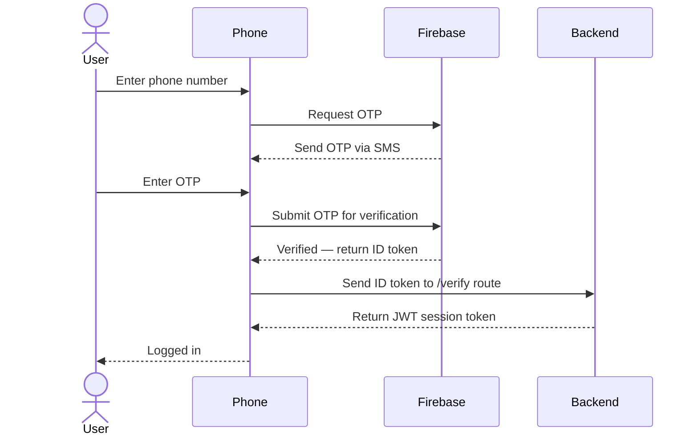

```mermaid
sequenceDiagram
    actor User
    participant Phone
    participant Firebase
    participant Backend

    User->>Phone: Enter phone number
    Phone->>Firebase: Request OTP
    Firebase-->>Phone: Send OTP via SMS
    User->>Phone: Enter OTP
    Phone->>Firebase: Submit OTP for verification
    Firebase-->>Phone: Verified — return ID token
    Phone->>Backend: Send ID token to /verify route
    Backend-->>Phone: Return JWT session token
    Phone-->>User: Logged in
```
